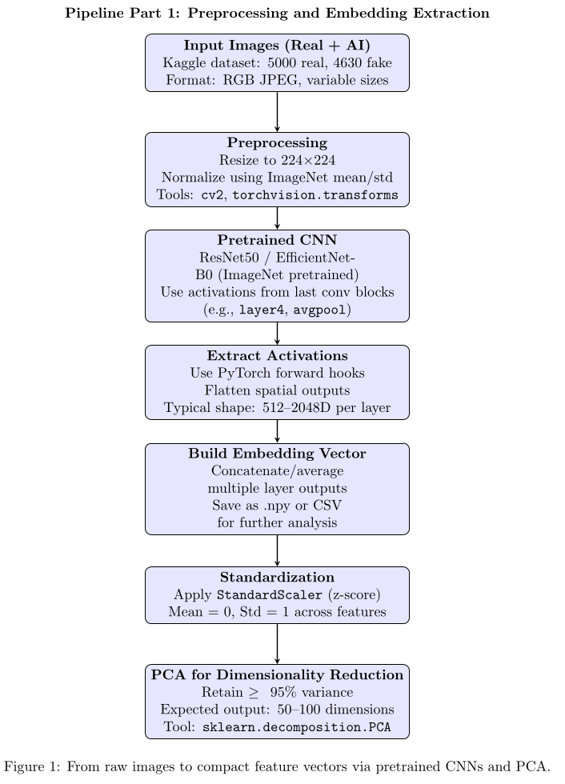

# Our README

python -m uvicorn scripts.xai_face_clustering.api.inference_api:app --reload

curl -X POST "http://127.0.0.1:8000/predict" -F "file=@/home/karbolak/Documents/Uni/AppliedML/AppliedML_project/scripts/xai_face_clustering/data/Human_Faces_ds/fake/FLUX1_dev_image_0000015.jpg"


## Install current requirements with:
1. **Via Conda**:

- Create a new environment via:
    
```bash
conda create -n {name_of_env}
```
        
- Activate your new environment:
```zsh
conda activate {name_of_env}
```
        
- Add conda-forge to your environment's channels, such that packages(e.g: mahotas) are available:
    
```zsh
conda config --add channels conda-forge
```
        
- Install requirements through:
    
```zsh
conda install --yes --file requirements.txt
```


    
2. **Via pip**, update **requirements.txt** commands(*opencv -> opencv-python*, *pytorch -> torch*) and run in terminal:
```zsh
pip install -r requirements.txt
```

## Test with:
```zsh
PYTHONPATH=. pytest --cov=xai_face_clustering tests/  
```

## Add embedding files with git lfs (for future reference):
```zsh
git lfs install # I've done all of that already
git lfs track "*.npz"
git add .gitattributes
git add xai_face_clustering/features/embeddings.npz 
```

## Project setup




## Project structure

```zsh
├── **init**.py
├── main.py
├── README.md
├── requirements.txt
├── tests
│   ├── data
│   │   └── **init**.py
│   ├── features
│   │   └── **init**.py
│   ├── **init**.py
│   ├── models
│   │   └── **init**.py
│   └── test\_main.py
└── xai_face_clustering
├── data
│   ├── Human\_Faces\_Dataset
│   └── **init**.py
├── features
│   ├── exploratory\_plots
│   ├── exploratory\_plots.py
│   └── **init**.py
├── **init**.py
└── models
└── **init**.py
```

• **_main.py_**

    Role: The orchestrator of the pipeline.

    Calls:

        Data loading

        Feature extraction

        Dimensionality reduction

        Clustering

        Surrogate model + XAI explanation

    Structure: Use argparse to control mode (e.g., --visualize, --cluster, --explain).

• **xai_face_clustering/data/**

    Purpose:

        Stores raw datasets.

        Includes loaders or utilities for reading images, resizing, and normalizing.

    To implement:

        load_images() → returns image tensors + filenames

        Optionally cache resized versions

• **xai_face_clustering/features/_exploratory_plots.py_**

    Purpose:

        Handles EDA: plots of texture, symmetry, t-SNE, etc.

    Functions:

        plot_texture_histogram(...)

        plot_edge_boxplot(...)

        plot_tsne_projection(...)

    Can be imported by main.py when --visualize is passed

• **xai_face_clustering/features/**

    General feature logic:

        cnn_embeddings.py (to create) → extract features via forward hooks from pretrained models.

        pca.py (to create) → handles dimensionality reduction.

        scaler.py (optional) → apply and persist StandardScaler.

• **xai_face_clustering/models/**

    Purpose:

        Encapsulates model logic for clustering and surrogate model.

        Keeps separation of concerns.

    Suggested files:

        clustering.py

            cluster_embeddings(): K-Means / DBSCAN

        surrogate.py

            train_surrogate_model()

            predict_and_explain()

        xai.py

            run_shap_explanation() and/or run_lime_explanation()
• **xai_face_clustering/features/_pca.py_**
    This is a heavy file, takes a lot of RAM and time to run, hence, to achieve a smoother flow, the implementation checks for caches.
    Procedure:
        The file will be run only once, on its first attempt. 
        In future attempts, the newly ran main will access a saved path, path which stores cached features.

• **tests/**

    Contains:

        test_main.py: checks CLI calls and pipeline integrity

        tests/data/: mock datasets

        tests/features/: test edge cases in preprocessing

        tests/models/: unit tests for clustering, surrogate, and explanation steps


<!---
# Applied ML Template 🛠️


**Welcome to Applied Machine Learning!** This template is designed to streamline the development process and boost the quality of your code.

Before getting started with your projects, we encourage you to carefully read the sections below and familiarise yourselves with the proposed tools.

## Prerequisites
Make sure you have the following software and tools installed:

- **PyCharm**: We recommend using PyCharm as your IDE, since it offers a highly tailored experience for Python development. You can get a free student license [here](https://www.jetbrains.com/community/education/#students/).

- **Pipenv**: Pipenv is used for dependency management. This tools enables users to easily create and manage virtual environments. To install Pipenv, use the following command:
    ```bash
    $ pip install --user pipenv
    ```
    For detailed installation instructions, [click here](https://pipenv.pypa.io/en/latest/installation.html).

- **Git LFS**: Instead of committing large files to your repository, you should store and manage them using Git LFS. For installation information, [click here](https://github.com/git-lfs/git-lfs?utm_source=gitlfs_site&utm_medium=installation_link&utm_campaign=gitlfs#installing).

## Getting Started
### Setting up your own repository
1. Fork this repository.
2. Clone your fork locally.
3. Configure a remote pointing to the upstream repository to sync changes between your fork and the original repository.
   ```bash
   git remote add upstream https://github.com/ivopascal/Applied-ML-Template
   ```
   **Don't skip this step.** We might update the original repository, so you should be able to easily pull our changes.
   
   To update your forked repo follow these steps:
   1. `git fetch upstream`
   2. `git rebase upstream/main`
   3. `git push origin main`
      
      Sometimes you may need to use `git push --force origin main`. Only use this flag the first time you push after you rebased, and be careful as you might overwrite your teammates' changes.
### Git LFS
1. Set it up for your user account (only once, not each time you want to use it).
    ```bash
    git lfs install
    ```
2. Select the files that Git LFS should manage. To track all files of a certain type, you can use a wildcard as in the command below.
    ```bash
   git lfs track "*.psd"
    ```
3. Add _.gitattributes_ to the staging area.
    ```bash
    git add .gitattributes
    ```
That's all, you can commit and push as always. The tracked files will be automatically stored with Git LFS.

### Pipenv
This tool is incredibly easy to use. Let's **install** our first package, which you will all need in your projects.

```bash
pipenv install pre-commit
```

After running this command, you will notice that two files were created, namely, _Pipfile_ and _Pipfile.lock_. _Pipfile_ is the configuration file that specifies all the dependencies in your virtual environment.

To **uninstall** a package, you can run the command:
```bash
pipenv uninstall <package-name>
```

To **activate** the virtual environment, run `pipenv shell`. You can now use the environment as you wish. To **deactivate** the environment run the command `exit`.

If you **already have access to a Pipfile**, you can install the dependencies using `pipenv install`.

For a comprehensive list of commands, consult the [official documentation](https://pipenv.pypa.io/en/latest/cli.html).

### Unit testing
You are expected to test your code using unit testing, which is a technique where small individual components of your code are tested in isolation.

An **example** is given in _tests/test_main.py_, which uses the standard _unittest_ Python module to test whether the function _hello_world_ from _main.py_ works as expected.

To run all the tests developed using _unittest_, simply use:
```bash
python -m unittest discover tests
```
If you wish to see additional details, run it in verbose mode:
```bash
python -m unittest discover -v tests
```

### Pre-commit
Another good coding practice is using pre-commit hooks. This is used to inspect the code before committing to ensure it matches your standards.

In this course, we will be using two hooks (already configured in _.pre-commit-config.yaml_):
- Unit testing
- Flake8 (checks your code for errors, styling issues and complexity)

Since we have already configured the hooks, all you need to do is run:
```bash
pre-commit install
```
Now `pre-commit` will automatically run whenever you want to commit something to the repository.

## Get Coding
You are now ready to start working on your projects.

We recommend following the same folder structure as in the original repository. This will make it easier for you to have cleaner and consistent code, and easier for us to follow your progress and help you.

Your repository should look something like this:
```bash
├───data  # Stores .csv
├───models  # Stores .pkl
├───notebooks  # Contains experimental .ipynbs
├───project_name
│   ├───data  # For data processing, not storing .csv
│   ├───features
│   └───models  # For model creation, not storing .pkl
├───reports
├───tests
│   ├───data
│   ├───features
│   └───models
├───.gitignore
├───.pre-commit-config.yaml
├───main.py
├───train_model.py
├───Pipfile
├───Pipfile.lock
├───README.md
```

**Good luck and happy coding! 🚀**
-->

